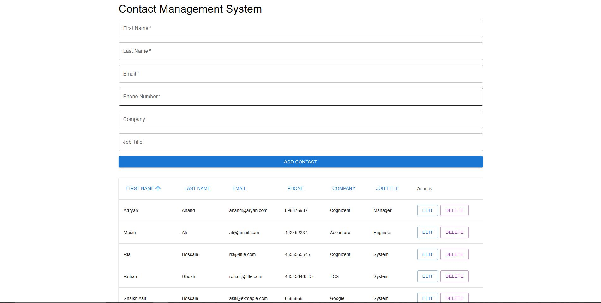

# 📞 Contact Management System 🗂️
Welcome to the Contact Management System! This project helps users manage and organize customer/client contact information, providing a seamless way to track, view, update, and delete contacts—perfect for businesses and individuals who want to maintain strong relationships.

# 📌 Links
* GitHub Repo: Contact Management System [Link](https://github.com/asifhossain12/Assignment-Erino)
* Live Demo: I recorded my screen to show the live demonstration of the project on Local host [Link](https://drive.google.com/file/d/1ojCAudg_vW_mt0Q6ZmxGtt1t67tys3BF/view?usp=drive_link)

# 📝 Features
- Add New Contact: Capture essential details like first name, last name, email, phone number, company, and job title.
- View Contacts: Display all contacts in an organized table with sorting and pagination features.
- Edit Contact Information: Keep your records up to date by editing contact details as needed.
- Delete Contact: Remove outdated or duplicate contacts to keep the list clean and relevant.
  
# 🎯 Key Technologies
- Frontend: ReactJS with Material UI (MUI)
- Backend: Django
- Database: MySQL
  
# 🚀 Getting Started

To get started with this project, follow the setup instructions below. You'll need to set up both the Frontend (ReactJS) and Backend (Django) to get the app running.

## 🔧 Prerequisites

Before starting, ensure you have the following installed:

- Node.js (For the Frontend)
- Django (For the Backend)
- MySQL (Database)
  
If you're using MySQL, ensure it's running locally or on a remote server.

# 📝 Screenshots




# 🖥️ Frontend Setup (ReactJS)
1. Clone the repository:

```
git clone https://github.com/asifhossain12/Assignment-Erino.git
cd contact-management-system
```

2. Install the required dependencies:

```
cd frontend
npm install
```

3. Start the ReactJS development server:

```
npm run dev
```
The frontend should now be running on http://localhost:5173/

4. Remeber to the include the .env file in the frontend directory

```
VITE_API_URL=http://localhost:8000/api
```


# ⚙️ Backend Setup (Django)

1. Navigate to the backend directory:

```
cd contact_project
```

2. Create a virtual environment and activate it:

```
python -m venv venv
source venv/bin/activate  # For Linux/MacOS
venv\Scripts\activate     # For Windows
```

3. Install the required dependencies:

```
pip install -r requirements.txt
```

4. Configure MySQL database settings in settings.py under the DATABASES section:

- Make a separate .env file for the backend directory as well 

```
SECRET_KEY=    // your django secrect key (founds in settings.py)

DEBUG=True

ALLOWED_HOSTS=localhost,127.0.0.1

CORS_ALLOWED_ORIGINS=http://localhost:5173

DB_ENGINE=django.db.backends.mysql
DB_NAME=contact_manager
DB_USER='your_mysql_user',  # MySQL username
DB_PASSWORD='your_mysql_password',  # MySQL password
DB_HOST=localhost
DB_PORT=3306
```

5. Run the migrations to set up the database:

```
python manage.py makemigrations
python manage.py migrate
```

6. Start the Django development server:

```
python manage.py runserver
```

7. The backend should now be running on http://localhost:8000.


# 💡 Key Features
## Contact Form 📋
- A dynamic form to add new contacts using Material UI (MUI) components.
- Fields: First Name, Last Name, Email, Phone Number, Company, Job Title.
- Form validation ensures correct data entry.
## Contacts Table 📊
- Displays all contacts in a table.
- Sorting and pagination for efficient browsing.
- Action buttons to edit or delete contacts.
## Backend API Endpoints 🔌
- POST /contacts/create/: Add a new contact.
- GET /contacts/: Retrieve all contacts.
- PUT /contacts/:id/update/: Update a contact by ID.
- DELETE /contacts/:id/delete/: Delete a contact by ID.
## Database 🗄️
- MySQL stores contact data.
- CRUD operations are fully supported in the database.

# 📋 Database Schema
For MySQL, the contacts table schema will look something like this:

```
CREATE TABLE contacts (
    id INT AUTO_INCREMENT PRIMARY KEY,
    first_name VARCHAR(100) NOT NULL,
    last_name VARCHAR(100) NOT NULL,
    email VARCHAR(100) NOT NULL,
    phone_number VARCHAR(15) NOT NULL,
    company VARCHAR(100),
    job_title VARCHAR(100)
);
```

#  🧑‍💻 Challenges and Solutions
## Challenge 1: Handling Pagination and Sorting in the Contacts Table
- Solution: Initially, understanding pagination and sorting with Material UI was a challenge. I researched online resources and tutorials to better understand how to implement these features. Once I grasped the concept, I was able to integrate the functionality seamlessly into the app.
## Challenge 2: Testing Endpoints with Postman
- Solution: Testing the API endpoints in Postman took more time than expected, especially when debugging unexpected responses or issues. To overcome this, I meticulously checked and debugged the backend code to identify and resolve errors, ensuring all endpoints worked as intended.
## Challenge 3: Connecting the React Frontend with the Django Backend
- Solution: Integrating the React frontend with the Django backend required careful handling of API requests and responses. I used Axios to send HTTP requests from React to the Django API. During the process, I encountered minor errors (e.g., typos or configuration issues). To resolve these, I double-checked my code and made sure to fix any small mistakes that could impact the app's communication.


Thank you for checking out the Contact Management System! 😊

